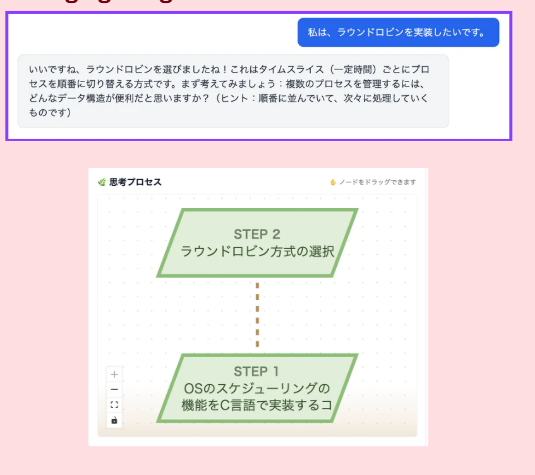
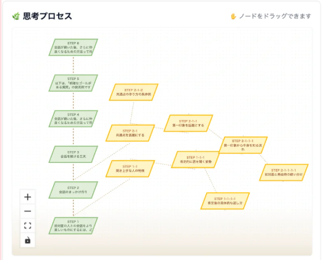
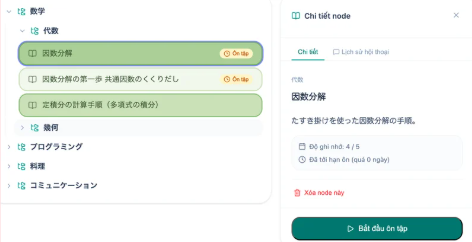

# Chill Education

An educational AI web application designed to help students learn actively with AI, rather than simply copying answers generated by AI.

The application positions AI as a thinking partner that guides students through questions, hints, and structured learning processes instead of directly providing answers.

---

## Purpose

As generative AI becomes increasingly common among students, there is a risk that learners become overly dependent on AI and stop developing their own understanding and critical thinking.

Chill Education aims to address this problem by changing the role of AI in learning:

- From an AI that provides answers
- To an AI that supports thinking
- From passive copy-and-paste learning
- To active thinking and discovery

Instead of directly teaching the answer, the AI guides students with hints and questions so that they can discover the answer themselves.

---

## Key Features and Solutions

### 1. AI Tutor — Learning Through Guided Thinking

The AI Tutor is designed not to give students the answer directly.

Key functions include:

- Breaking complex questions into smaller elements.
- Providing relevant hints.
- Giving familiar examples or analogies.
- Asking questions that encourage the student to think independently.
- Using open-ended questions to encourage broader thinking.
- Using guiding questions to gradually lead the learner toward a specific goal.

The goal is to make AI a thinking partner rather than an answer provider.

**(ANH — AI Tutor conversation / guided-question UI)**

---

### 2. Mind Tree — Visualizing the Learning Process

The application represents the conversation history as a tree structure, allowing students to see how their thinking developed throughout the learning process.

Key functions include:

- **Conversation history visualization**  
  Chat logs are displayed as an interactive map, making it easier to review the learning process.

- **Flexible branching**  
  Students can return to an earlier point and explore a different idea or approach without losing the previous path.

- **Thinking traces**  
  The tree preserves the student's attempts, trials, and errors, allowing them to see how their reasoning developed.

- **Multi-perspective problem solving**  
  Previous ideas and branches can be reviewed to help students approach a problem from different perspectives.

**(ANH — Mind Tree / conversation branching UI)**

---

### 3. Knowledge Storage

The application stores learned content in a hierarchical tree structure, allowing students to review their accumulated learning history at a glance.

The system also visualizes the learner's memory level using colors based on:

- **Ebbinghaus' forgetting curve**
- **Spaced repetition**

This allows students to identify knowledge that is approaching the point of being forgotten and review it at an appropriate time.

The knowledge node's memory level is represented on a scale from 1 to 5. As the number of reviews increases, the knowledge node becomes progressively darker green.

**(ANH — Knowledge Tree / memory-level visualization)**

---

### 4. Anti-Copy Mechanism

The application prevents students from simply copying the AI's response.

Instead, students are encouraged to process the information themselves and enter the answer in their own words.

This is intended to improve:

- Understanding
- Active thinking
- Knowledge retention

**(ANH — Anti-copy / answer input UI)**

---

## Usage Flow

A typical learning process with Chill Education is:

1. The student asks a question.
2. The AI analyzes the problem.
3. Instead of immediately providing the answer, the AI gives a hint or asks a guiding question.
4. The student thinks about the problem and responds.
5. The conversation is recorded as part of the learning tree.
6. Different approaches can be explored through branches.
7. Learned knowledge is stored for future review.
8. The system indicates when knowledge should be reviewed based on the forgetting curve and spaced repetition.

This creates a learning process centered around active discovery rather than passive answer consumption.

---

## Technology Stack

### Frontend

- React
- TypeScript
- React Flow
- React Query

### Backend

- Django REST Framework
- PostgreSQL / SQLite

### AI Core

- Claude LLM
- JSON-based LLM integration
- Structured data type conversion

---

## How to Run

### 1. Install Dependencies

    npm install

### 2. Start the Development Server

    npm run dev

The application will be available at:

    http://localhost:5173/

### 3. Build for Production

    npm run build

### 4. Preview the Production Build

    npm run preview

### 5. Lint the Project

    npm run lint

---

## Project Vision

Chill Education aims to change the way students interact with AI.

Instead of treating AI as a tool that simply produces answers, the application encourages students to think, explore, make mistakes, review their reasoning, and discover solutions by themselves.

The ultimate goal is to make AI a partner in the learning process, while preserving the student's own thinking and understanding.
